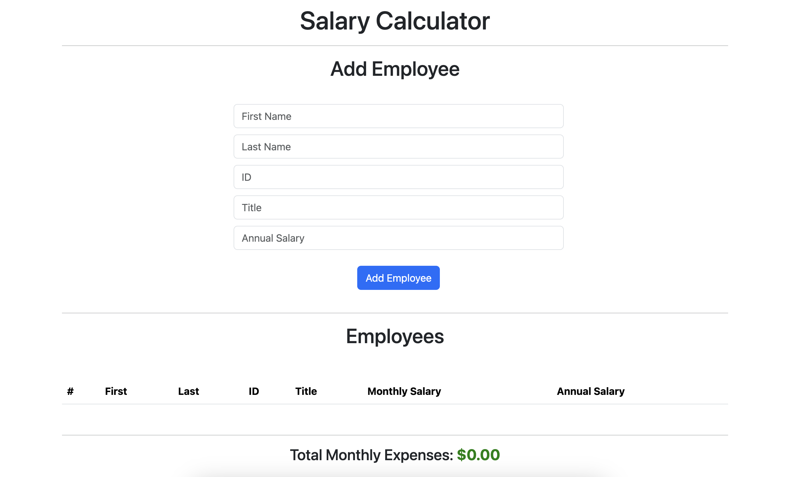
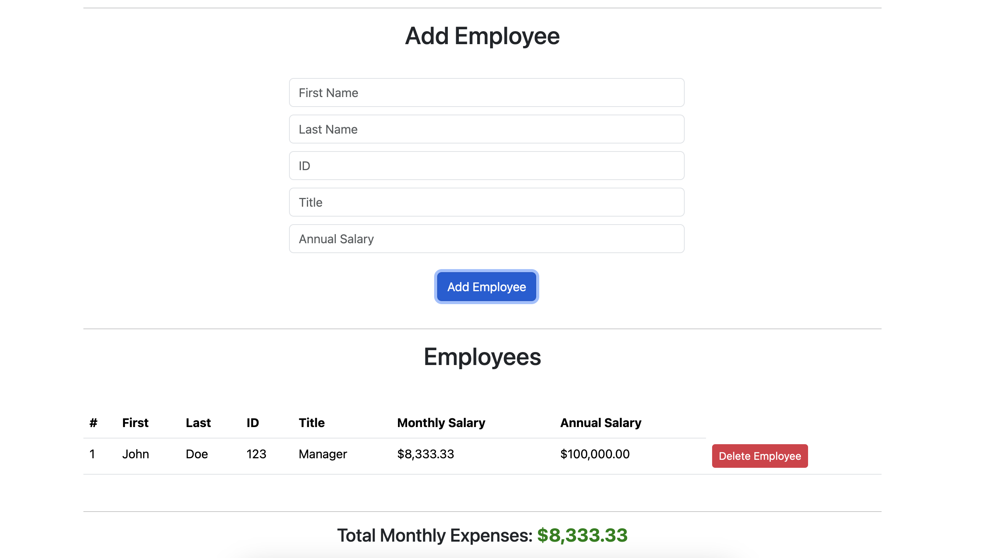
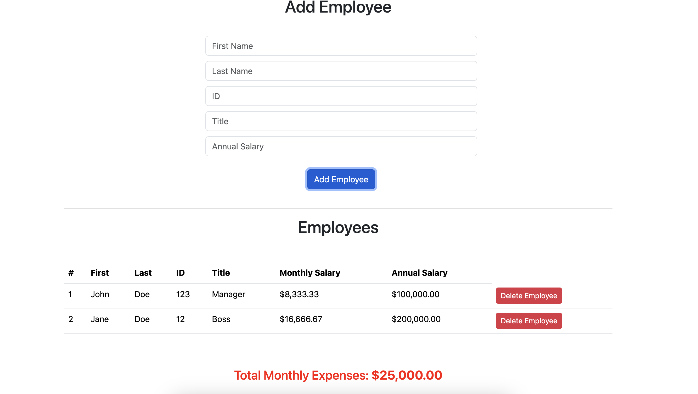

ANNUAL SALARY CALCULATOR

# Description
Duration: Weekend Project

The specific requirements from the client was a working webpage which allowed them to track user data:
    - Name
    - Employee ID
    - Title
    - Annual Salary

And then create a web page which tracked all of this data in addition to converting the annual salary to a monthly salary

To see the fully functional site, please visit: Not implemented at this time!

## Screen Shot
Base Line: 
Within Budget: 
Outside of Budget: 

### Prerequisites
Before you begin, ensure you have met the following requirements:

- **Node.js**: The project is built with Node.js. If you don't have Node.js installed, you can download it from [here](https://nodejs.org/).
- **Express**: This project uses the Express framework for Node.js. After installing Node.js, you can install Express by running `npm install express` in the terminal. Learn more about Express [here](https://expressjs.com/).
- **JavaScript**: Basic knowledge of JavaScript is required. If you're new to JavaScript, start learning [here](https://developer.mozilla.org/en-US/docs/Web/JavaScript/Guide).
- **HTML**: This project uses HTML for structuring web pages. Learn more about HTML [here](https://developer.mozilla.org/en-US/docs/Web/HTML).
- **CSS**: CSS is used for styling the HTML content. Find more about CSS [here](https://developer.mozilla.org/en-US/docs/Web/CSS).

Make sure you have all these prerequisites installed and set up before starting with the project setup.

#### Installation
How do you get your application up and running? This is a step by step list for how another developer could get this project up and running. The good target audience in terms of knowledge, would be a fellow Primer from another cohort being able to spin up this project. Note that you do not need a paragraph here to intro Installation. It should be step-by-step.

    1. npm init --yes
    2. npm install
    3. npm install express
    4. npm start
    5. navigate to your localhost port 5001 on your web browser and ensure that port is not currently being used by any other application

##### Usage
This web application allows a company to enter the following information
    - Name
    - Employee ID
    - Title
    - Annual Salary

It then converts the annual salary into a monthly salary and displays all of the relevant information in a table format on your favorite browser. It will calculate the monthly budget and alert you when you exceed the predefined monthly budget ($20,000)

##### Built With
Javascript
Bootstrap
HTML/CSS

##### Acknowledgement
Thanks to Prime Digital Academy who equipped and helped me to make this application a reality. (Thank your people)

##### Support
If you have suggestions or issues, please let me know!